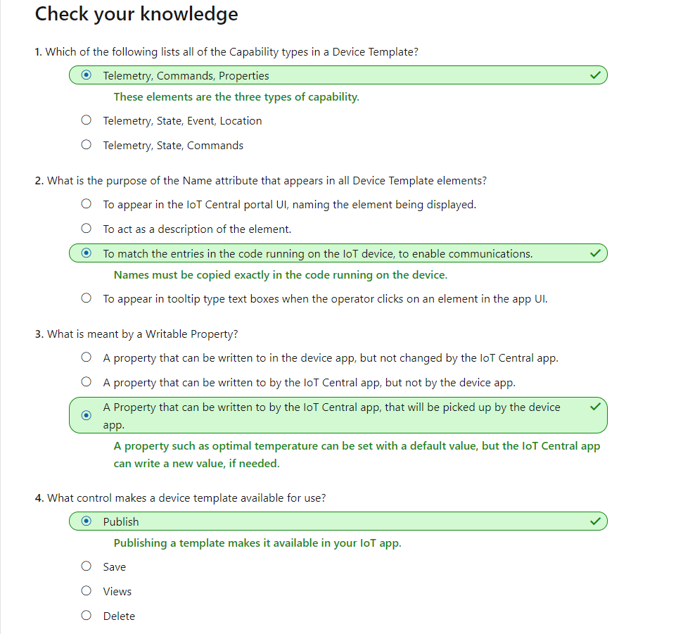

# Create Your First Azure IoT Central App

## Create a custom IoT Central app

Go to [Azure IoT Central](https://apps.azureiotcentral.com/).  
Click on `Build`, choose `Custom apps`.  
Enter `Application name`, `URL` must be unique.  
Leave `Application template` as `Custom application`.  
Click `Create`.

## Create a device template

The data communicated between a remote device, and IoT Central, is specified in a *device template*.

Select `Device templates`, click `+ New` to create a new template.  
Select `IoT Device`, click `Next: Customize`.  
Enter the name for the template. Click `Next: Review`, and then click `Create`.  
Click `Custom` to create a capability model.  
Click `Add interface`, then `Custom`, to start building a blank interface.  
Click `Add capability`, put in the values and click `Save`.  
In this example, we need to set a temperature. We set the `Semantic type` as `Temperature`, `Schema` as `Double`,
and `Unit` as `°C`.  
We also need to set a few state telemetry. We set the contents state as `empty`, `full` and `melting`,
and the cooling system state as `on`, `off`, and `failed`,
and the truck state as `ready`, `enroute`, `delivering`, `returning`, `loading`, and `dumping`.  
To set the event telemetry, we set `Semantic type` as `Event`, and `Schema` as `String`.  
For the location telemetry, we set `Semantic type` as `Location`, and `Schema` as `Geopoint`.

### Add properties

A property of a device is typically a constant value, that is communicated to the IoT Central app when communication is first initiated. Properties can also be device configuration data. A setting has an initial default value, which may not need to be changed, but the ability to change it easily and quickly is there, if needed. This kind of property is called a *writable property*.  
A property is a single value. If more complex sets of data need to be transmitted to a device, a Command is the more appropriate way of handling it.

In this example, we'll need to add Truck ID, optimal temperature properties. We also need to add the comands of `Go to customer`
and `Recall`. When turn `Request` on, you'll be able to enter more details of the command.

Click `Save` to review the template. `Publish` the template when everything is set corectly.

## Create a rich dashboard and a real device

### Create a rich dashboard

In the template we have created, go to `Views` and click on `Visualizing the device`. Give a name to the view. Add some telemry and properties tiles into the view. When everything is arranged nicely, click `Save` and then `Publish`.

### Create a real device

Click `Devices` in the left-hand menu. Click `+ New` to create a new device. Choose the template we created previously. Give a device name and device id. and click `Create`.

Click on the device just created, it brings you to the `Truck View` waiting for data. In the `Commands` tab, you can see the commands we created earlier.

### Record the connection keys

Click `Connect` at the top right corner. In the `Device connection` dialog, copy `ID scope`, `Device ID` and `Primary key` to a text file.

## Knowledge Check



## Set up your development environment

### Create a free Azure Maps acount

Create `Azure Maps` resource. In `Authentication`, copy the `Primary key`.

## Create a programming project for a real device

### Create the device app

Open Visual Studio, and create a new `Console App`.  
Install the following `NuGet Packages`.

- AzureMapsRestToolkit
- Microsoft.Azure.Devices.Client
- Microsoft.Azure.Devices.Provisioning.Client
- Microsoft.Azure.Devices.Provisioning.Transport.Mqtt
- System.Text.Json
- Microsoft.Extensions.Logging.Console

Add logging in `Program.cs`.

```C#
static ILogger<Program> Logger => LoggerFactory.Create(builder =>
{
    builder.AddConsole().AddDebug();
})
.CreateLogger<Program>();
```

Add global variables in `Program.cs`.

```C#
static string ScopeID = "<your Scope ID>";
static string TruckDeviceId = "Truck1";
static double BaseLat = 47.644702;              // Base position latitude.
static double BaseLon = -122.130137;            // Base position longitude.

static string GlobalDeviceEndpoint = "global.azure-devices-provisioning.net";
static string AzureMapsKey = "<your Azure Maps key>";
static string PrimaryKey = "<your device Primary Key>";

static double[,] Customers = new double[,]
{
    // Lat/lon position of customers.
    // Gasworks Park
    {47.645892, -122.336954},

    // Golden Gardens Park
    {47.688741, -122.402965},

    // Seward Park
    {47.551093, -122.249266},

    // Lake Sammamish Park
    {47.555698, -122.065996},

    // Marymoor Park
    {47.663747, -122.120879},

    // Meadowdale Beach Park
    {47.857295, -122.316355},

    // Lincoln Park
    {47.530250, -122.393055},

    // Gene Coulon Park
    {47.503266, -122.200194},

    // Luther Bank Park
    {47.591094, -122.226833},

    // Pioneer Park
    {47.544120, -122.221673}
};
```

Add `TruckState`, `ContentsState` and `FanState` enums.

```C#
public enum TruckState
{
    Ready,
    Enroute,
    Delivering,
    Returning,
    Loading,
    Dumping
}

public enum ContentsState
{
    Full,
    Melting,
    Empty
}

public enum FanState
{
    On,
    Off,
    Failed
}
```

Create a new `Truck` class in a new file.

```C#
public class Truck
{
    private const string NoEvent = "none";
    private const double TooWarmThreshold = 2;
    private const int IntervalInSeconds = 60;
    private const double TooWarmtooLong = 60;
    private const double LoadingTime = 800;
    private const double DeliverTime = 600;
    private const double DumpingTime = 400;
    private const int IntervalInMilliseconds = 5000;

    private readonly string _scopeId;
    private readonly string _globalDeviceEndpoint;
    private readonly string _primaryKey;
    private string _eventText = NoEvent;
    private TwinCollection _reportedProperties = new TwinCollection();
    private DeviceClient _deviceClient;
    private AzureMapsServices _azureMapsServices;
    private double[,] _path;
    private double[] _timeOnPath;
    private int _truckOnSection;
    private double _truckSectionsCompletedTime;
    private double _timeOnCurrentTask = 0;
    private double _baseLat;
    private double _baseLon;
    private double _tempContents = -2;
    private double _optimalTemperature = -5;
    private double _tooWarmPeriod = 0;

    public Truck(
        string deviceId,
        string primaryKey,
        string scopeId,
        string globalDeviceEndpoint)
    {
        DeviceId = deviceId;
        _primaryKey = primaryKey;
        _scopeId = scopeId;
        _globalDeviceEndpoint = globalDeviceEndpoint;
    }

    public void SetBasePosition(double lat, double lon)
    {
        CurrentLat = lat;
        CurrentLon = lon;
        _baseLat = lat;
        _baseLon = lon;
    }

    public void ConnectToAzureMap(string azureMapsKey)
    {
        _azureMapsServices = new AzureMapsServices(azureMapsKey);
    }
}
```

Add in `Main(string[] args)` in `Program.cs`, create a new truck instance. Set to the default position, and connect to Azure Maps Services.

```C#
var truck = new Truck(TruckDeviceId, PrimaryKey, ScopeID, GlobalDeviceEndpoint);
truck.SetBasePosition(BaseLat, BaseLon);
truck.ConnectToAzureMap(AzureMapsKey);
```

Add a method to connect the device to Azure IoT Central in `Truck` class.

```C#
public async Task ConnectAsync()
{
    using var security = new SecurityProviderSymmetricKey(DeviceId, _primaryKey, null);

    var result = await RegisterDeviceAsync(security);

    if (result.Status != ProvisioningRegistrationStatusType.Assigned)
        throw new Exception("Failed to register device");

    var auth = new DeviceAuthenticationWithRegistrySymmetricKey(
        result.DeviceId,
        (security as SecurityProviderSymmetricKey).GetPrimaryKey());

    _deviceClient = DeviceClient.Create(result.AssignedHub, auth, TransportType.Mqtt);
}

private async Task<DeviceRegistrationResult> RegisterDeviceAsync(
    SecurityProviderSymmetricKey security
    )
{
    using (var transport = new ProvisioningTransportHandlerMqtt(TransportFallbackType.TcpOnly))
    {
        var provClient = ProvisioningDeviceClient.Create(_globalDeviceEndpoint, _scopeId, security, transport);
        return await provClient.RegisterAsync();
    }
}
```

Connect to Azure IoT Central in `Program.cs`.

``` C#
Logger.LogInformation("Connecting device...");
await truck.ConnectAsync();
Logger.LogInformation("Device successfully connected to Azure IoT Central");
```

Add a method to send properties in `Truck` class.

```C#
public async Task SendDevicePropertiesAsync(string key, string value)
{
    _reportedProperties[key] = value;
    await _deviceClient.UpdateReportedPropertiesAsync(_reportedProperties);
}
```

Send device property `TruckID` in `Program.cs`.

```C#
Logger.LogInformation("Send device property TruckID {TruckID}...", TruckDeviceId);
await truck.SendDevicePropertiesAsync("TruckID", TruckDeviceId);
Logger.LogInformation("Sucessfully sent device property TruckID {TruckID}.", TruckDeviceId);
```

Register setting change handler. In this example, it's for "Optimal Temperature".  
In `Truck` class.

```C#
public async Task SetDesiredOptimalTemperatureSettingUpdateCallbackAsync()
{
    await _deviceClient.SetDesiredPropertyUpdateCallbackAsync(HandleOptimaTemperatureSettingChanged, null);
}

private async Task HandleOptimaTemperatureSettingChanged(TwinCollection desiredProperties, object userContext)
{
    var setting = "OptimalTemperature";
    if (desiredProperties.Contains(setting))
    {
        BuildAcknowledgement(desiredProperties, setting);
        OptimalTemperature = (double) desiredProperties[setting]["value"];
    }
    await _deviceClient.UpdateReportedPropertiesAsync(_reportedProperties);
}
```

In `Program.cs`.

```C#
Logger.LogInformation("Registering optimal temperature setting changed handler...");
await truck.SetDesiredOptimalTemperatureSettingUpdateCallbackAsync();
Logger.LogInformation("Optimal temperature setting changed handler registered.");
```

Add commands handler in `Truck` class.

```C#
public async Task SetCommandHandlersAsync(double[,] customers)
{
    await _deviceClient.SetMethodHandlerAsync("GoToCustomer", GoToCustomerCommand, customers);
    await _deviceClient.SetMethodHandlerAsync("Recall", RecallCommand, null);
}

private async Task<MethodResponse> GoToCustomerCommand(MethodRequest methodRequest, object userContext)
{
    try
    {
        // Pick up variables from the request payload, with the name specified in IoT Central.
        var payloadString = Encoding.UTF8.GetString(methodRequest.Data);
        var customerNumber = int.Parse(payloadString);
        var customers = (double[,])userContext;

        // Check for a valid key and customer ID.
        if (customerNumber >= 0 && customerNumber < customers.Length)
        {
            switch (TruckState)
            {
                case TruckState.Dumping:
                case TruckState.Loading:
                case TruckState.Delivering:
                    _eventText = "Unable to act - " + TruckState;
                    break;
                case TruckState.Ready:
                case TruckState.Enroute:
                case TruckState.Returning:
                    if (ContentsState == ContentsState.Empty)
                    {
                        _eventText = "Unable to act - empty";
                    }
                    else
                    {
                        // Set event only when all is good.
                        _eventText = "New customer: " + customerNumber.ToString();

                        DestinationLat = customers[customerNumber, 0];
                        DestinationLon = customers[customerNumber, 1];

                        // Find route from current position to destination, storing route.
                        await GetRouteAsync(TruckState.Enroute);
                    }
                    break;
            }

            // Acknowledge the direct method call with a 200 success message.
            string result = "{\"result\":\"Executed direct method: " + methodRequest.Name + "\"}";
            return await Task.FromResult(new MethodResponse(Encoding.UTF8.GetBytes(result), 200));
        }
        else
        {
            _eventText = $"Invalid customer: {customerNumber}";

            // Acknowledge the direct method call with a 400 error message.
            string result = "{\"result\":\"Invalid customer\"}";
            return await Task.FromResult(new MethodResponse(Encoding.UTF8.GetBytes(result), 400));
        }
    }
    catch
    {
        // Acknowledge the direct method call with a 400 error message.
        string result = "{\"result\":\"Invalid call\"}";
        return await Task.FromResult(new MethodResponse(Encoding.UTF8.GetBytes(result), 400));
    }
}

private async Task<MethodResponse> RecallCommand(MethodRequest methodRequest, object userContext)
{
    switch (TruckState)
    {
        case TruckState.Ready:
        case TruckState.Loading:
        case TruckState.Dumping:
            _eventText = "Already at base";
            break;

        case TruckState.Returning:
            _eventText = "Already returning";
            break;

        case TruckState.Delivering:
            _eventText = "Unable to recall - " + TruckState;
            break;

        case TruckState.Enroute:
            await ReturnToBaseAsync();
            break;
    }

    // Acknowledge the command.
    if (_eventText == NoEvent)
    {
        // Acknowledge the direct method call with a 200 success message.
        string result = "{\"result\":\"Executed direct method: " + methodRequest.Name + "\"}";
        return await Task.FromResult(new MethodResponse(Encoding.UTF8.GetBytes(result), 200));
    }
    else
    {
        // Acknowledge the direct method call with a 400 error message.
        string result = "{\"result\":\"Invalid call\"}";
        return await Task.FromResult(new MethodResponse(Encoding.UTF8.GetBytes(result), 400));
    }
}

private async Task GetRouteAsync(TruckState newState)
{
    // Set the state to ready, until the new route arrives.
    TruckState = TruckState.Ready;

    var req = new RouteRequestDirections
    {
        Query = FormattableString.Invariant($"{CurrentLat},{CurrentLon}:{DestinationLat},{DestinationLon}")
    };
    var directions = await _azureMapsServices.GetRouteDirections(req);

    if (directions.Error != null || directions.Result == null)
    throw new Exception("Failed to find map route");

    var nPoints = directions.Result.Routes[0].Legs[0].Points.Length;

    // Clear the path. Add two points for the start point and destination.
    _path = new double[nPoints + 2, 2];
    int c = 0;

    // Start with the current location.
    _path[c, 0] = CurrentLat;
    _path[c, 1] = CurrentLon;
    ++c;

    // Retrieve the route and push the points onto the array.
    for (var n = 0; n < nPoints; n++)
    {
        var x = directions.Result.Routes[0].Legs[0].Points[n].Latitude;
        var y = directions.Result.Routes[0].Legs[0].Points[n].Longitude;
        _path[c, 0] = x;
        _path[c, 1] = y;
        ++c;
    }

    // Finish with the destination.
    _path[c, 0] = DestinationLat;
    _path[c, 1] = DestinationLon;

    // Store the path length and time taken, to calculate the average speed.
    var meters = directions.Result.Routes[0].Summary.LengthInMeters;
    var seconds = directions.Result.Routes[0].Summary.TravelTimeInSeconds;
    var pathSpeed = meters / seconds;

    double distanceApartInMeters;
    double timeForOneSection;

    // Clear the time on path array. The path array is 1 less than the points array.
    _timeOnPath = new double[nPoints + 1];

    // Calculate how much time is required for each section of the path.
    for (var t = 0; t < nPoints + 1; t++)
    {
        // Calculate distance between the two path points, in meters.
        distanceApartInMeters = DistanceInMeters(_path[t, 0], _path[t, 1], _path[t + 1, 0], _path[t + 1, 1]);

        // Calculate the time for each section of the path.
        timeForOneSection = distanceApartInMeters / pathSpeed;
        _timeOnPath[t] = timeForOneSection;
    }

    _truckOnSection = 0;
    _truckSectionsCompletedTime = 0;
    _timeOnCurrentTask = 0;

    // Update the state now the route has arrived. One of: enroute or returning.
    TruckState = newState;
}

private static double DistanceInMeters(double lat1, double lon1, double lat2, double lon2)
{
    var dlon = Degrees2Radians(lon2 - lon1);
    var dlat = Degrees2Radians(lat2 - lat1);

    var a = (Math.Sin(dlat / 2) * Math.Sin(dlat / 2)) + 
        Math.Cos(Degrees2Radians(lat1)) * Math.Cos(Degrees2Radians(lat2)) * (Math.Sin(dlon / 2) * Math.Sin(dlon / 2));
    var angle = 2 * Math.Atan2(Math.Sqrt(a), Math.Sqrt(1 - a));
    var meters = angle * 6371000;
    return meters;
}

private static double Degrees2Radians(double deg)
{
    return deg * Math.PI / 180;
}

private async Task ReturnToBaseAsync()
{
    DestinationLat = _baseLat;
    DestinationLon = _baseLon;

    // Find route from current position to base, storing route.
    await GetRouteAsync(TruckState.Returning);
}
```

In `Program.cs`, add command handler.

```C#
Logger.LogInformation("Creating commands handler...");
// Create a handler for the direct method calls.
await truck.SetCommandHandlersAsync(Customers);
Logger.LogInformation("Commands handler created.");
```

Add two private methods in `Truck` class to determine if the truck has moved onto next section, and if the truck has arrived the destination.

```C#
private bool _hasMovedOntoNextSection =>
  _truckSectionsCompletedTime + _timeOnPath[_truckOnSection] < _timeOnCurrentTask &&
  _truckOnSection < _timeOnPath.Length - 1;

private bool _arrived =>
  DistanceInMeters(CurrentLat, CurrentLon, DestinationLat, DestinationLon) < 10;
```

Add methods to send telemetry and update truck in `Truck` class.

```C#
public async Task SendTruckTelemetryAsync(Random rand, CancellationToken token)
{
    while (true)
    {
        await UpdateTruckAsync();

        // Create the telemetry JSON message.
        var telemetryDataPoint = new
        {
            ContentsTemperature = Math.Round(_tempContents, 2),
            TruckState = TruckState.ToString(),
            CoolingSystemState = FanState.ToString(),
            ContentsState = ContentsState.ToString(),
            Location = new { lon = CurrentLon, lat = CurrentLat },
            Event = _eventText,
        };
        var telemetryMessageString = JsonSerializer.Serialize(telemetryDataPoint);
        var telemetryMessage = new Message(Encoding.ASCII.GetBytes(telemetryMessageString));

        // Clear the events, as the message has been sent.
        _eventText = NoEvent;

        // Bail if requested.
        token.ThrowIfCancellationRequested();

        // Send the telemetry message.
        await _deviceClient.SendEventAsync(telemetryMessage);
        await Task.Delay(IntervalInMilliseconds);
    }
}

private async Task UpdateTruckAsync()
{
    if (ContentsState == ContentsState.Empty)
    {
        // Turn the cooling system off, if possible, when the contents are empty.
        if (FanState == FanState.On) FanState = FanState.Off;

        _tempContents += -2.9 + DieRoll(6);
    }
    else
    {
        // Contents are full or melting.
        if (FanState != FanState.Failed)
        {
            // Turn the cooling system off, as contents are getting too cold.
            if (_tempContents < _optimalTemperature - 5) FanState = FanState.Off;
            // Temp getting higher, turn cooling system back on.
            else if (_tempContents > _optimalTemperature) FanState = FanState.On;

            // Randomly fail the cooling system.
            if (DieRoll(100) < 1) FanState = FanState.Failed;
        }

        // Set the contents temperature. Maintaining a cooler temperature if the cooling system is on.
        _tempContents += FanState == FanState.On ? -3 + DieRoll(5) : -2.9 + DieRoll(6);

        // If the temperature is above a threshold, count the seconds this is occurring, and melt the contents if it goes on too long.
        if (_tempContents >= TooWarmThreshold)
        {
            // Contents are warming.
            _tooWarmPeriod += IntervalInSeconds;

            // Contents are melting.
            if (_tooWarmPeriod >= TooWarmtooLong) ContentsState = ContentsState.Melting;
        }
        // Contents are cooling.
        else _tooWarmPeriod = Math.Max(0, _tooWarmPeriod - IntervalInSeconds);
    }

    _timeOnCurrentTask += IntervalInSeconds;

    switch (TruckState)
    {
        case TruckState.Loading:
            if (_timeOnCurrentTask >= LoadingTime)
            {
                // Finished loading.
                TruckState = TruckState.Ready;
                ContentsState = ContentsState.Full;
                _timeOnCurrentTask = 0;

                // Turn on the cooling fan.
                // If the fan is in a failed state, assume it has been fixed, as it is at the base.
                FanState = FanState.On;
                _tempContents = -2;
            }
            break;

        case TruckState.Ready:
            _timeOnCurrentTask = 0;
            break;

        case TruckState.Delivering:
            if (_timeOnCurrentTask >= DeliverTime)
            {
                // Finished delivering.
                ContentsState = ContentsState.Empty;
                await ReturnToBaseAsync();
            }
            break;

        case TruckState.Returning:

            // Update the truck position.
            UpdatePosition();

            // Check to see if the truck has arrived back at base.
            if (_arrived)
            {
                switch (ContentsState)
                {
                    case ContentsState.Empty:
                        TruckState = TruckState.Loading;
                        break;

                    case ContentsState.Full:
                        TruckState = TruckState.Ready;
                        break;

                    case ContentsState.Melting:
                        TruckState = TruckState.Dumping;
                        break;
                }
                _timeOnCurrentTask = 0;
            }
            break;

        case TruckState.Enroute:

            // Move the truck.
            UpdatePosition();

            // Check to see if the truck has arrived at the customer.
            if (_arrived)
            {
                TruckState = TruckState.Delivering;
                _timeOnCurrentTask = 0;
            }
            break;

        case TruckState.Dumping:
            if (_timeOnCurrentTask >= DumpingTime)
            {
                // Finished dumping.
                TruckState = TruckState.Loading;
                ContentsState = ContentsState.Empty;
                _timeOnCurrentTask = 0;
            }
            break;
    }
}

private static double DieRoll(double max)
{
    return new Random().NextDouble() * max;
}

private void UpdatePosition()
{
    while (_hasMovedOntoNextSection)
    {
        // Truck has moved onto the next section.
        _truckSectionsCompletedTime += _timeOnPath[_truckOnSection];
        ++_truckOnSection;
    }

    // Ensure remainder is 0 to 1, as interval may take count over what is needed.
    var remainderFraction = 
        Math.Min(1, (_timeOnCurrentTask - _truckSectionsCompletedTime) / _timeOnPath[_truckOnSection]);

    // The path should be one entry longer than the timeOnPath array.
    // Find how far along the section the truck has moved.
    CurrentLat = 
        _path[_truckOnSection, 0] + 
        remainderFraction * (_path[_truckOnSection + 1, 0] - _path[_truckOnSection, 0]);
    CurrentLon = 
        _path[_truckOnSection, 1] + 
        remainderFraction * (_path[_truckOnSection + 1, 1] - _path[_truckOnSection, 1]);
}
```

Add the method in `Program.cs` to simulate the truck's state and movements.

```C#
Logger.LogInformation("Start sending telemetry...");
await truck.SendTruckTelemetryAsync(new Random(), token.Token);

Console.WriteLine("Press any key to exit.");
Console.ReadKey();
token.Cancel();
```

## Test your IoT Central device
