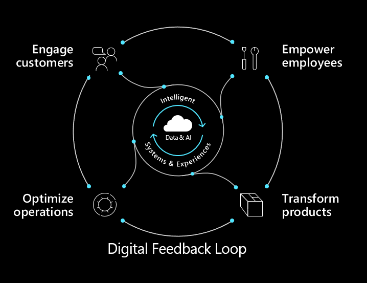
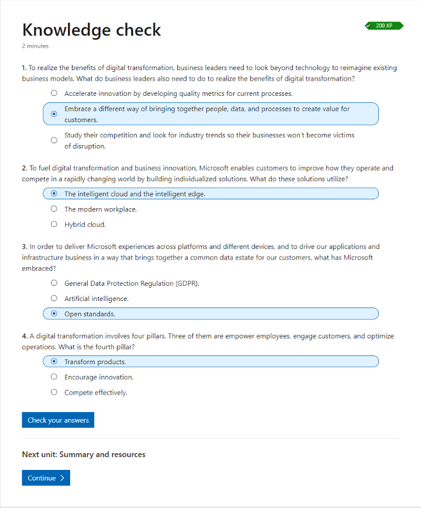

# Introduction to Azure IoT

Azure IoT provides end-to-end IoT solutions as one part of digital transformation to achieve business outcomes.

## What is digital transformation

**Digital transformation** is about reimaging how you bring together people, data, and process to create value for your customers and maintain a competitive advantage in a digital-first world.

Digital technologies enable impactful digital transformation across four pillars:

- Empower employees - Help your employees achieve more by creating a work environment that's intelligent, flexible and secure.
- Engage customers - Tailor individual customer experiences by harnessing data and drawing actionable insights.
- Optimize operations - Accelerate the responsiveness of your business, improve service levels, and reduce costs with intelligent processes.
- Transform products - Find and capture the best new opportunities by using data as a strategic asset and shifting from hindsight to foresight.

### Digital feedback loop

The digital feedback loop takes data endpoints or signals from new software-infused sources, and then brings them together to gain insights that drive continuous innovation. The intelligent edge then multiplies the available data points to bring in and enhance the information available to the digital feedback loop. Dynamics 365 uses the digital feedback loop by picking up telemetry data from multiple sources, including external sources.

Dynamics 365 and Power Platform then analyze the telemetry to create business insights. For example, you can train AI to review data collected from IoT enabled equipment and develop preventative maintenance schedules and improved manufacturing processes. You can then further apply the insights to help better qualify sales leads and identify marketing prospects.

## Success factors for digital transformation

The problems of existing ERP and CRM applications are that they silo and trap data, holding organizations back in their efforts to meet customer expectations. Digital transformation can fuel the success of an organization and allow it to achieve real, tangible rewards by shifting "**Reactive Action**" to "**Proactive Action**", "**Siloed View**" to "**Connected View**", "**Reporting Activity**" to "**Delivering Outcomes**".

### Four factors common to successful digital transformations

- Vision and Strategy
- Culture
- Unique Potential
- Capabilities

## Why digitally transform with Microsoft

Microsoft enables its customers and partners to build cutting-edge, individualized solutions utilizing the power of the **intelligent cloud** and the **intelligent edge**.

The **intelligent cloud** is ubiquitous computing enabled by the cloud and powered with AI. The **intelligent edge** is the continually expanding set of connected systems and devices that gather and analyze information close to the physical world where data resides.

### Steps of digital transformation

- Envision your future business
- Define business and operating models
- Build a compelling case for change
- Share your vision
- Execute on your vision

## Knowledge Check

## Key takeaways

1. Microsoft drives digital transformation for its customers across these four pillars: Empower employees, Engage customers, Optimize operations, Transform products.
2. Data from the Microsoft Solution areas feeds the intelligent cloud and intelligent edge to fuel digital transformation and business innovation.
3. Microsoft 365, Dynamics 365, and Azure enable you to build cutting-edge, individualized solutions.
4. The digital feedback loop enables digital transformation. It captures digital signals from across the business, connects and synthesizes the data, and drives insights that can help improve business outcomes.
5. The keys to success in your digital transformation journey are: Vision and strategy, Culture, Unique potential and Capabilities.
