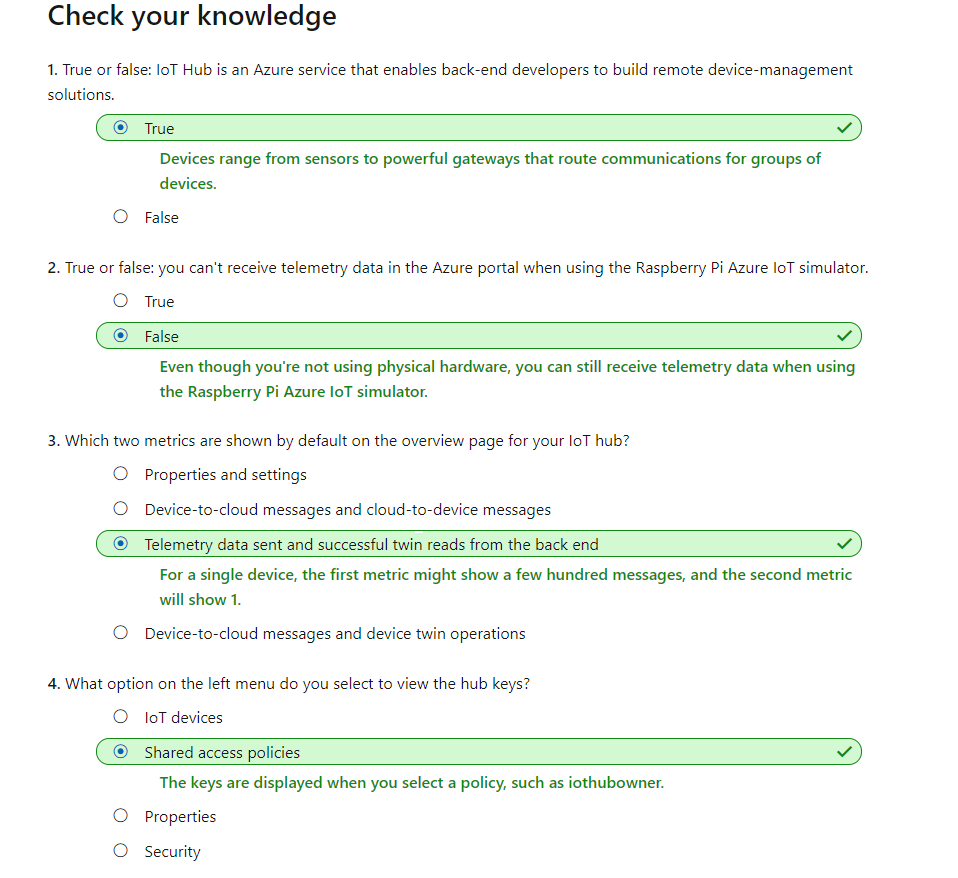

# How to Manage IoT Devices as an IT Admin

A [Raspberry Pi Azure IoT Web Simulator](https://azure-samples.github.io/raspberry-pi-web-simulator/) is used as a device.

## Create an IoT Hub

Go to Azure Portal, choose `Create a resouce`, search for `IoT Hub` and click `Create`.  
Choose `Subscription`, `Resource Group` and `Region`, and give a name to IoT Hub.  
Click `Review + Create`, and then `Create`.

## Register a device

Go to your IoT Hub resoruce, in the left menu, select `IoT Devices`, and then select `+ New`.  
Give a meaningful `Device ID`, and then `Save`.  
Go to the device in IoT Hub, copy the `Primary Connection String`, and then go to the simulator, update the connection string in the code.

## Send simulated telemetry

In the simulator, select `Run` to start the application. You should see the sensor data and message sent to your IoT Hub in the output.

## Read the telemetry from your hub

In IoT Hub, under `Monitoring`, select `Metrics`. For `Metric` find `Telemetry messages sent`, and select `Sum` for Aggregation.  
Change the time range to `Last 30 minutes`.

## Administer your IoT hub

### Explore the IoT Hub menu

#### Overview

The overview contains some useful data. If you scroll to the bottom of the page, you'll see two charts. By default, the **Telemetry messages sent** and **Successful twin reads from back end* metrics are displayed here.

#### Settings

##### Shared access policies

This entry is used to get the keys for all the policies that have been defined for the hub. You can create custom policies if needed.

##### Properties

This entry brings up a range of strings that apply to your hub, including name, region, and subscription.

#### Explorers

##### IoT devices

One of the main uses of this entry is to *locate the device connection strings and keys*. Device keys are distinct from the *service keys* for the hub itself.

#### Security

**Overview** is for security recommendations when you have a production hub running.

#### Monitoring

**Alerts** fire when certain conditions, usually errors or warnings, are met.

## Knowledge Check

