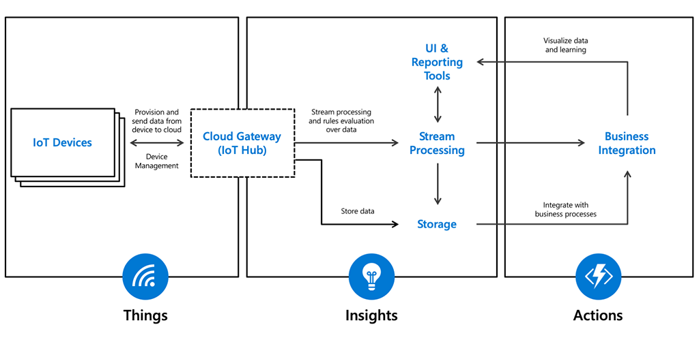
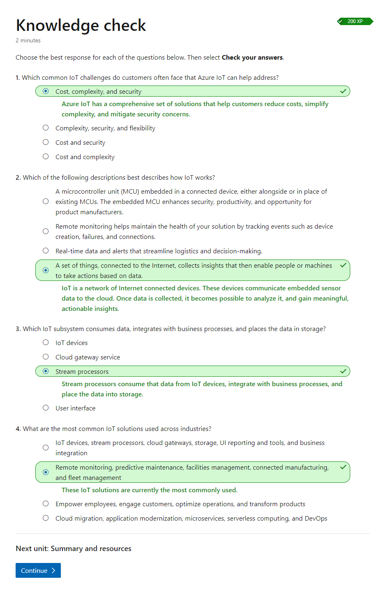

# Microsoft Azure IoT Strategy and Solutions

## Introduction to the Internet of Things (IoT)

### What is IoT

**The Internet of Things (IoT)** is a network of Internet connected devices that communicate sensor data to the cloud for centralized processing. These sensors are typically embedded in monitoring devices. These devices, known as ***IoT devices***, have some processing power to control communications. The stream of data they generate is known as ***telemetry***. The most used telemetry values are ***acceleration***, ***humidity***, ***location***, ***pressure***, ***temperature***, and ***velocity***. There are many other values that might be useful.

At the other end, in the cloud, a resource known as an ***IoT hub*** collects the data, and processes it. The hub might also communicate back to the devices, perhaps changing settings or parameters.

### Why is IoT useful

- IoT enables a single human operator, through a cloud portal, to monitor and control a vast array of remote devices.
- IoT enables businesses to evolve their operations.
- IoT enables the possiblity to analyze the data to gain meaningful, actionable insights, which might help increase efficiency, reduce waste, or lower costs.
- These insights might make smart spaces more secure.

### IoT Solutions

IoT can be envisioned as a set of technologies connected across three main areas:

- Things: Physical "things," with embedded sensors, that are connected to the Internet. These things send telemetry data.
- Insights: The results from processing and analyzing the data. IoT real-time analysis, machine learning, and other backend processes, produce these insights.
- Actions: The automated, or manual, response to the insights. Actions include the automated changing of device settings, a manual intervention to repair a piece of equipment, or an update to a computer system that is not working optimally.

## Why Azure for IoT

Microsoft Azure IoT helps leverage the skills, technology, and resources you already have, to create an IoT solution. Your solution can easily capture data from your connected devices, and then create valuable insights into your business.

With Azure IoT, you can build intelligence across your organization by bringing machine learning and artificial intelligence (AI) to the solution. These advanced technologies lead to faster predictions, smarter actions, and a secure and trusted platform.

### Business Challenges

#### Complexity

IoT implementation and operations can be complex. Azure IoT reduces complexity by providing services that can securely add, and connect devices, and ingest, store, and analyze your data. Azure IoT also offers ***Build with Azure IoT Central***, a managed app platform, to rapidly build an IoT solution.

#### Cost

Implementing an IoT solution can be expensive. With Azure IoT, customers can choose a fully managed or finished solution, *from a partner*. Another option is building with *Azure IoT Central*, a fully-managed SaaS offering, with per device pricing, that makes the cost to start and upgrade clear, and predictable, for your proposed solution. A third option is to build from an *Azure IoT Hub*. Azure IoT Hub has the same predictable pricing, with great flexibility, though might require greater technical expertise.

#### Security

Without proper planning and oversight, IoT can be prone to security vulnerabilities in areas like device control and data privacy. Azure IoT is built for security, with an end-to-end approach to maintain control and trust, for data, devices, messaging, and cloud applications. The *Azure Security Center* provides automated support right to your Azure portal.

### What does an Azure IoT architecture look like

An IoT application consists of the following subsystems:

1. **Devices** that can securely register with the cloud, and send telemetry data. These devices might have settings that can be specified from the cloud. Alternatively, multiple devices might communicate locally with an ***Edge Gateway device***. The edge device can perform some local optimization, and communicates with the cloud for the global picture.

2. A **cloud gateway service, or hub**, to securely read the incoming data, and provide some device management capabilities.

3. **Stream processors** that consume the telemetry data, integrate with business processes, and place the data into storage.

4. A **user interface** to visualize data, and enable easy device management.

## Innovate with Azure IoT Industry Solutions

### Azure IoT solutions applied across industries

- Remote monitoring, e.g. in-store analytics and smart inventory management in retail industry; water quality, connected waste management and weather monitoring for governments; continuous monitoring of patients in healthcare.
- Predictive maintenance, e.g. predictive maintenance to monitor equipment for early signs that maintenance is required in manufacturing industry.
- Facilities management, the *Digital Twin* feature of an Azure IoT Hub provides the capabilities to manage *recorded* and *desired* device settings. E.g.optimize energy usage in energy industry, monitor and adjust the environment of refrigerated storage in agriculture industry. Controll physical access in a smart building.
- Connected manufacturing, e.g. real-time performance monitoring of solar panel production lines in the renewable energy industury.
- Fleet management, e.g. real-time visibility to track location and speed of vehicles in the transportation industry.

### Azure IoT Services

- Azure IoT Hub - A managed service hosted in the cloud, Azure IoT Hub acts as a central message hub for bi-directional communication between your IoT application and the devices it manages.
- Azure IoT Central - A hosted IoT app platform that's secure, scales with you as your business grows, and integrates with your existing business apps.
- Azure Sphere - The Azure Sphere Security Service guards every Azure Sphere device; it brokers trust for device-to-device and device-to-cloud communication, detects emerging threats, and updates device security.
- Azure Device Provisioning Service (DPS) - Azure DPS provisions devices globally, at scale, from a single cloud control point.
- Azure Security Center for IoT - Provides a holistic view of IoT solution security posture for DevOps and IoT solution managers.
- Azure IoT Edge - Azure IoT Edge is a fully managed service, that is built on Azure IoT Hub. An edge device has similar capabilities to a hub. This service is meant for customers who want to analyze the bulk of device data locally, instead of in the cloud.
- Azure Time Series Insights - Connect to billions of events in Azure IoT Hub or Azure Event Hub, and visualize and analyze billions of events to spot anomalies, and discover hidden trends, in your time series data.
- Azure Maps - Azure Maps includes a host of features to handle geospatial data. For IoT apps, useful features include traffic, routing, weather, and search.
- Azure Digital Twins - Azure Digital Twins is an IoT service that creates comprehensive software models of the physical environment.

### Azure IoT Hub SDKs

For intermediate and advanced developers, there is a range of IoT SDKs. The SDKs support new features from IoT Hub, as updates are released, so you can incorporate these new features with minimal code, and ensure your solution is up-to-date.

In the context of IoT, a *module* is an independent connection from a device to a hub. Suppose a device has three sensors, and each sensor sends telemetry to a different department in your organization. If your IoT solution uses modules, then each department will only have visibility to the sensor data that they own.

The SDKs support .NET, C, Java, Node.js, Python, and iOS.

- Azure IoT Device SDKs - The Microsoft Azure IoT device SDKs contain code that facilitates building apps that connect to, and are managed by, Azure IoT Hub services.
- Azure IoT Service SDKs - The Azure IoT service SDKs contain code to facilitate building applications that interact directly with IoT Hub, to manage devices and security.
- Provisioning Device SDKs - Enables you to build apps that run on your IoT devices, to communicate with the Device Provisioning Service.
- Provisioning Service SDKs - Enables you to build backend applications, to manage your enrollments in the Device Provisioning Service.

## Knowledge Check

## Key Takeaways

1. Microsoft Azure IoT addresses common business challenges. Azure IoT can help accelerate business transformation, by reducing cost and complexity, while improving security at scale.
2. Insights uncovered from connected devices, using backend systems, can be transformed into powerful applications and services to achieve business success.
3. Azure IoT supports a wide range of business outcomes, across many industries. These outcomes include empowering employees, engaging customers, optimizing operations, and transforming products.
